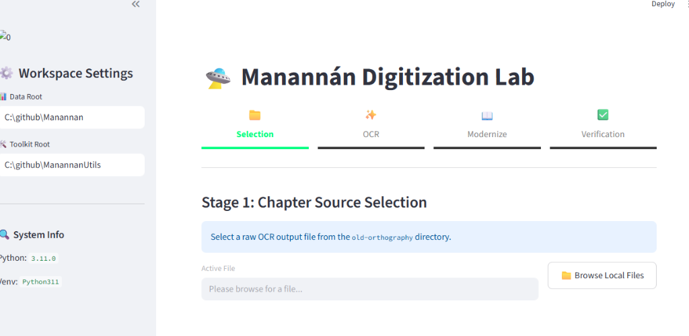
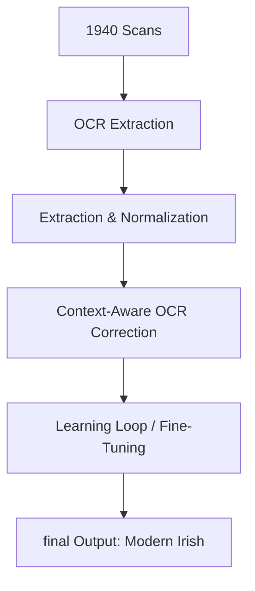

# 🌊 Manannán Digitization Project
 


[](https://www.python.org/downloads/)
[](#)
[](#)

The **Manannán Digitization Project** is a sophisticated technical initiative dedicated to the preservation and modernization of *Manannán*, a landmark Irish-language young adult science fiction novel. 

Published in 1940 by **Máiréad Ní Ghráda**, *Manannán* is a cornerstone of early speculative fiction in Ireland. It is notable for featuring:
* 🤖 One of the earliest global literary depictions of a **mecha**.
* 🚀 The first known literary mention of a **gravity assist**.

---

## 🏛️ The Challenge: From Cló Gaelach to Modern Orthography

The primary obstacle in this digitization effort is the linguistic transition from historical **Cló Gaelach** (Gaelic type) and old orthography into modern Irish standards (*An Caighdeán Oifigiúil*). 

The 1940 text utilizes the *ponc nua* (dot over consonants) to signify lenition (e.g., `Ḃ`, `Ṡ`). Modernizing this involves a complex mapping to their "h" equivalents (e.g., `Bh`, `Sh`) while preserving casing and context.

---

## 🚀 The Pipeline Architecture

Our hybrid pipeline bridges the gap between raw OCR extraction and high-fidelity linguistic output through custom Python-based post-processing.



### 1. Extraction & Normalization
The `convert_orthography.py` tool handles the complex character mapping:
* **Unicode Awareness**: Manages both precomposed characters (e.g., `Ḃ`) and decomposed characters (standard `B` + `U+0307` dot above) to eliminate encoding "ghost" errors.
* **Casing Intelligence**: Maps capitalization contextually (e.g., `Ṫ` becomes `TH` in all-caps segments, but `Th` in standard title case).

### 2. Context-Aware OCR Correction
The `ocr_fixer.py` utility acts as a specialized logic layer to repair common OCR hallucinations:
* **Linguistic Heuristics**: Prevents accidental de-hyphenation of Irish mutative prefixes (e.g., *n-*, *t-*, and *h-*).
* **Stray Capitalization**: Automatically repairs single-letter capitals and mixed-case words misidentified by standard OCR engines.
* **Pagination Tracking**: Harvesting page markers (e.g., `[l.31]: #`) and maintaining stateful counting across multiple files.

### 3. The "Learning Loop"
The pipeline is driven by a `corrections_dict.json` configuration that matures as more text is processed:
* **Verified Dictionary**: High-confidence 1-to-1 mapping for common misreadings (e.g., `Ac` -> `Aċ`).
* **Contextual Phrases**: Phrase-level regex replacements to handle complex grammatical errors and OCR patterns.
* **Fine-Tuning**: Rapid injection of new corrections directly into the pipeline via `fine_tune.py`.

---

## 📂 Project Structure

```bash
/
├── caibidlí/
│   ├── old-orthography/    # Transcribed "Source of Truth" from 1940 scans.
│   └── new-orthography/    # Modernized text following An Caighdeán Oifigiúil.
├── python-utils/           # Core toolset (Orthography conversion, OCR fixing, inspection).
│   ├── config/             # corrections_dict.json and linguistic rules.
│   └── ...scripts...
└── epub/                   # Tooling for digital edition building (Pandoc & custom CSS).
```

---

## 🛠️ How to Use the Tools

*Note: Scripts should be run from the `python-utils` directory to ensure configuration paths are resolved correctly.*

**1. Streamlit Digitization Lab (Recommended):**
The primary mission-control dashboard. It offers a guided **Wizard UI** for chapter processing and automatic path-handling.
cd C:\github\ManannanUtils
streamlit run python-utils/streamlit_app.py

**2. Apply OCR Fixes (CLI):**
```bash
python python-utils/ocr_fixer.py caibidlí/old-orthography/manannan03.md --output caibidlí/old-orthography/manannan03_fixed.md
```

**3. Modernize Orthography (CLI):**
```bash
python python-utils/convert_orthography.py caibidlí/old-orthography/manannan03_fixed.md --output caibidlí/new-orthography/manannan03.md
```

**3. Add New Corrections to the Loop:**
```bash
python python-utils/fine_tune.py --json '{"Incorrect": "Plaineid", "Corrected": "ṗláinéid"}'
```

---

## 📈 Status & Contributions

The project is currently processing the **15 chapters** of the novel. 

### 🤝 How to Help
We welcome contributions, particularly from **Irish speakers and Gaeilgeoirí**:
- **Linguistic Review**: Helping refine the `verified` dictionary for 1940s-specific dialectal variations.
- **Python Enhancements**: Improving regex heuristics and pipeline efficiency.
- **Transcription**: Assisting in the manual correction of "old-orthography" source files.

Let's bring this landmark of Irish science fiction into the digital age. Go raibh maith agat!
